# Technical Architecture & Design Document

**Document Date**: October 25, 2025  
**Project**: ML POC - Archive Forecast  
**Audience**: Software Architects, DevOps Engineers, Senior Developers

---

## Table of Contents

1. [System Overview](#system-overview)
2. [Architecture Diagram](#architecture-diagram)
3. [Component Architecture](#component-architecture)
4. [Data Flow Diagrams](#data-flow-diagrams)
5. [Sequence Diagrams](#sequence-diagrams)
6. [Deployment Architecture](#deployment-architecture)
7. [Technology Stack](#technology-stack)
8. [Design Decisions](#design-decisions)
9. [Integration Points](#integration-points)
10. [Error Handling & Resilience](#error-handling--resilience)

---

## System Overview

The Archive Forecast system is a machine learning pipeline that predicts archive volumes and storage savings based on historical archive data. It follows a three-tier architecture:

- **Data Tier**: Historical archive data, training datasets, model artifacts
- **Processing Tier**: ML training pipeline, API service, monitoring layer
- **Presentation Tier**: REST API, Streamlit UI, Azure ML Studio

### High-Level Goals
- Train regression models on archive metrics
- Serve predictions via REST API (FastAPI + Azure Functions)
- Track experiments via MLflow
- Enable scenario planning through UI
- Deploy infrastructure as code (Terraform)

---

## Architecture Diagram

```mermaid
graph TB
    subgraph "Presentation Layer"
        UI["🖥️ Streamlit Web UI<br/>(Optional Phase 1)"]
        Swagger["📚 Swagger UI<br/>(FastAPI Docs)"]
    end
    
    subgraph "API Layer"
        FastAPI["⚡ FastAPI<br/>(Local Development)"]
        AzureFn["☁️ Azure Functions<br/>(HTTP Trigger + ASGI Shim)"]
        AzureML["🤖 Azure ML Studio<br/>(Phase 2)"]
    end
    
    subgraph "Inference Engine"
        InferenceEngine["🧠 Model Inference Pipeline<br/>• Feature Engineering<br/>• Predictions<br/>• Output Formatting"]
    end
    
    subgraph "Model & Artifacts"
        ModelStore["💾 Model Artifacts Store<br/>• model.joblib<br/>• model_card.json<br/>• feature_quantiles.json"]
    end
    
    subgraph "Training Pipeline"
        DataSources["📊 Data Sources<br/>• CSV Files<br/>• Synthetic Data<br/>• Azure Data Lake<br/>• Database Queries"]
        Training["🔧 Training Pipeline<br/>• Data Ingestion<br/>• Feature Engineering<br/>• Model Training<br/>• Evaluation<br/>• Export Artifacts"]
    end
    
    subgraph "Experiment Tracking"
        MLflow["📈 MLflow Server<br/>• Run Logs<br/>• Metrics<br/>• Artifacts<br/>• Parameters"]
    end
    
    subgraph "Azure Resources"
        Azure["☁️ Terraform Provisioned<br/>• Resource Group<br/>• Storage Account<br/>• ML Workspace<br/>• Key Vault"]
    end
    
    UI --> FastAPI
    Swagger --> FastAPI
    UI --> AzureFn
    
    FastAPI --> InferenceEngine
    AzureFn --> InferenceEngine
    AzureML --> InferenceEngine
    
    InferenceEngine --> ModelStore
    
    DataSources --> Training
    Training --> ModelStore
    Training --> MLflow
    
    ModelStore --> Azure
    MLflow --> Azure
    AzureFn --> Azure
```



---

## Component Architecture

### 1. **Training Component** (`src/ml/train.py`)

```mermaid
graph TD
    A["📥 Input: Historical Archive Data<br/>(CSV or Synthetic)"]
    B["🔍 Data Loading"]
    C["✓ Validation<br/>• Schema compliance<br/>• Type coercion<br/>• Null handling"]
    D["⚙️ Feature Engineering<br/>• Cyclical encoding month → sin/cos<br/>• Normalize file percentages<br/>• Compute derived features"]
    E["📊 Train/Val Split<br/>(80/20)"]
    F["🔧 Preprocessing Pipeline<br/>• StandardScaler on numerical features"]
    G["🤖 Model Training<br/>Algorithm: RandomForestRegressor<br/>n_estimators: 200<br/>Multi-output: archived_gb, savings_gb"]
    H["📈 Evaluation<br/>• MAE Mean Absolute Error<br/>• R² Score variance weighted<br/>• Per-target metrics"]
    I["📝 MLflow Logging<br/>• Parameters<br/>• Metrics<br/>• Artifacts<br/>• Run registration"]
    J["💾 Model Export<br/>• model.joblib<br/>• model_card.json<br/>• feature_quantiles.json"]
    K["✅ Output: Model Artifacts Ready"]
    
    A --> B --> C --> D --> E --> F --> G --> H --> I --> J --> K
    
    style A fill:#e1f5ff
    style K fill:#c8e6c9
    style G fill:#fff9c4
    style I fill:#ffe0b2
```



**Key Classes/Functions:**
- `synthesize_data()` - Generate synthetic training data
- `build_features()` - Feature engineering logic
- `train()` - Main training orchestration
- MLflow integration for experiment tracking

**Dependencies:**
- scikit-learn (model & preprocessing)
- pandas (data manipulation)
- numpy (numerical operations)
- mlflow (experiment tracking)
- joblib (model serialization)

---

### 2. **API Component** (`src/app/main.py`)

```mermaid
graph TD
    A["🔗 HTTP CLIENT"]
    B["Handler Router<br/>GET /health<br/>POST /predict<br/>GET /docs"]
    C["✓ Pydantic Validation<br/>• Schema check<br/>• Type coercion<br/>• 422 if invalid"]
    D["📥 Parse Request"]
    E["🔄 DataFrame Conversion"]
    F["⚙️ Feature Engineering<br/>_build_features()"]
    G["💾 Model Loading<br/>• Check MODEL_PATH<br/>• Load joblib<br/>• Cache in memory"]
    H["🧠 Inference<br/>• model.predict<br/>• Handle multi-output"]
    I["📋 Response Formatting<br/>• PredictResponseItem<br/>• JSON serialization"]
    J["⚠️ Error Handling<br/>FileNotFoundError → 503<br/>ValidationError → 422<br/>Exception → 400"]
    K["📤 HTTP Response"]
    
    A --> B
    B -->|Valid| C --> D --> E --> F --> G --> H --> I --> K
    B -->|Invalid| J --> K
    
    style A fill:#e1f5ff
    style K fill:#c8e6c9
    style J fill:#ffcccc
    style H fill:#fff9c4
```



**Pydantic Models:**
```
Instance
  ├─ month: str (YYYY-MM-01)
  ├─ total_files: int
  ├─ avg_file_size_mb: float
  ├─ pct_pdf: float
  ├─ pct_docx: float
  ├─ pct_xlsx: float
  └─ archive_frequency_per_day: float

PredictRequest
  └─ instances: List[Instance]

PredictResponseItem
  ├─ archived_gb_next_period: float
  └─ savings_gb_next_period: float

PredictResponse
  └─ predictions: List[PredictResponseItem]
```

**Endpoints:**
| Method | Path | Input | Output | Purpose |
|--------|------|-------|--------|---------|
| GET | /health | None | `{status: "ok"}` | Liveness probe |
| POST | /predict | PredictRequest | PredictResponse | Batch predictions |

---

### 3. **Azure Functions Component** (`azure-functions-api/HttpForecast/`)

```mermaid
graph TD
    A["☁️ Azure Functions Runtime"]
    B["🔌 HTTP Trigger Handler<br/>• Receives HTTP request<br/>• Authenticates Function key/AAD<br/>• Routes to ASGI app"]
    C["🔄 ASGI Shim<br/>• Convert Azure request → ASGI scope<br/>• Call FastAPI app<br/>• Convert ASGI response → Azure response"]
    D["📚 FastAPI Router<br/>Route to /health or /predict"]
    E["⚡ FastAPI Application"]
    F["📤 Azure Functions Response<br/>Return to HTTP client"]
    
    A --> B --> C --> D --> E --> F
    
    style A fill:#e1f5ff
    style B fill:#bbdefb
    style C fill:#90caf9
    style E fill:#fff9c4
    style F fill:#c8e6c9
```



**Implementation Pattern (ASGI Shim):**
```python
# Pseudocode for azure-functions-api/HttpForecast/__init__.py
import azure.functions as func
from src.app.main import app as fastapi_app

async def main(req: func.HttpRequest) -> func.HttpResponse:
    # Convert Azure request to ASGI scope
    # Call FastAPI app
    # Return Azure response
    pass
```

---

## Data Flow Diagrams

### Training Data Flow


### Inference Data Flow

```mermaid
graph LR
    A["👤 Client Request<br/>POST /predict JSON"]
    B["✓ Validation<br/>Pydantic"]
    C["DataFrame"]
    D["⚙️ Feature Eng"]
    E["Feature Matrix X"]
    F["💾 Model Load<br/>from Storage"]
    G["🧠 Inference<br/>predict"]
    H["Predictions Array<br/>N x 2"]
    I["📋 Format Response"]
    J["JSON Response<br/>predictions:[]"]
    K["✅ Client Receives"]
    
    A --> B --> C --> D --> E --> F --> G --> H --> I --> J --> K
    
    style A fill:#e1f5ff
    style K fill:#c8e6c9
    style G fill:#fff9c4
    style F fill:#ffe0b2
```



---

## Sequence Diagrams

### Training Sequence

```mermaid
sequenceDiagram
    actor Trainer
    participant DataSource
    participant Training as Training<br/>Pipeline
    participant MLflow as MLflow<br/>Server
    participant Storage
    
    Trainer->>DataSource: Load Data
    DataSource-->>Training: Data CSV/Synthetic
    
    Training->>Training: Validate Schema
    Training->>Training: Feature Engineering
    Training->>Training: Train/Val Split 80/20
    Training->>Training: Preprocessing (StandardScaler)
    Training->>Training: Model Training (RandomForest)
    Training->>Training: Evaluation (MAE, R²)
    
    Training->>MLflow: mlflow.start_run()
    MLflow-->>Training: Run ID: abc123
    
    Training->>MLflow: log_param(algorithm)
    Training->>MLflow: log_metric(mae, r2)
    
    Training->>Storage: Save model.joblib
    Training->>Storage: Save model_card.json
    
    Training->>MLflow: log_artifact(model_card.json)
    MLflow->>Storage: Store artifacts
    
    Training->>MLflow: end_run()
    MLflow-->>Trainer: ✓ Training Complete
```



### Inference/Prediction Sequence


### Data & Model Versioning Sequence

```mermaid
sequenceDiagram
    actor User
    participant Developer
    participant Training
    participant MLflow as MLflow<br/>Registry
    participant Storage as Artifact<br/>Store
    
    User->>Developer: Request new model
    Developer->>Developer: Update code
    Developer->>Training: Trigger training
    
    Training->>MLflow: mlflow.start_run()
    Training->>Training: Train & Evaluate
    Training->>MLflow: Log params/metrics
    MLflow->>Storage: Upload artifacts
    
    Training->>Storage: joblib.dump(model)
    Training->>MLflow: end_run()
    
    Developer->>Storage: Query: v2
    Storage-->>Developer: ✓ Model v2 ready
    
    Developer->>Developer: Deploy model v2
    User-->>Developer: ✓ New predictions available
```



### Azure Functions Request Sequence


---

## Deployment Architecture

### Local Development Setup

```
Developer Workstation
├── src/
│   ├── app/main.py ────────► uvicorn (FastAPI local server)
│   └── ml/train.py ────────► python runner
├── models/ ───────────────────► Trained artifacts
├── mlruns/ ──────────────────► Local MLflow tracking
└── .venv/ ─────────────────── Virtual environment
```

### Azure Deployment Architecture

```mermaid
graph TB
    subgraph Azure["Azure Resource Group<br/>(Terraform Provisioned)"]
        subgraph Compute["Compute Layer"]
            AzureFn["⚡ Azure Functions<br/>• Python 3.11<br/>• HTTP Trigger<br/>• ASGI Shim<br/>• Consumption Plan<br/>• Function key/AAD Auth"]
            AppService["🌐 App Service<br/>• Python 3.11<br/>• Streamlit Container<br/>• Calls /api/predict<br/>• Public URL"]
        end
        
        subgraph Storage["Storage Layer"]
            StorageAcc["💾 Azure Storage<br/>• Blob Containers:<br/>  - data/<br/>  - models/<br/>  - outputs/<br/>  - logs/"]
            KeyVault["🔐 Key Vault<br/>• Storage conn strings<br/>• MLflow tracking URI<br/>• API keys<br/>• DB credentials"]
        end
        
        subgraph Monitor["Analytics & Monitoring"]
            AppInsights["📊 Application Insights<br/>• Function metrics<br/>• API response times<br/>• Error rates<br/>• Custom events"]
            AzureML["🤖 Azure ML Workspace<br/>• Model registry<br/>• Training pipelines<br/>• Online endpoints<br/>• Drift monitoring"]
            MLflowServer["📈 MLflow Server<br/>• Tracking URI<br/>• Backend: Storage<br/>• UI: mlflow.azure.net<br/>• Private network"]
        end
    end
    
    Compute --> Storage
    Compute --> Monitor
    Monitor --> Storage
```



### Network Diagram

```mermaid
graph TB
    Internet["☁️ INTERNET<br/>(End Users, Clients)"]
    
    Internet -->|Request| FrontDoor["🌐 Azure Front Door<br/>(Load Balancing)"]
    
    FrontDoor --> AzureFn["⚡ Azure Functions<br/>(Predictions API)"]
    FrontDoor --> AppService["🌐 App Service<br/>(Streamlit UI)"]
    
    AzureFn -->|Private| VNet["🔒 Virtual Network<br/>(Private Subnet)"]
    AppService -->|Private| VNet
    
    subgraph VNet["Private Network"]
        Storage["💾 Storage Account<br/>(Private Endpoint)"]
        KV["🔐 Key Vault<br/>(Private Endpoint)"]
        AppIns["📊 App Insights"]
    end
    
    AzureFn -.->|Managed Identity| KV
    AppService -.->|Managed Identity| KV
    KV -.->|Access| Storage
```



---

## Technology Stack

### Core Dependencies

| Layer | Technology | Version | Purpose |
|-------|-----------|---------|---------|
| **ML Framework** | scikit-learn | ~1.0+ | Model training & inference |
| | numpy | ~1.20+ | Numerical operations |
| | pandas | ~1.3+ | Data manipulation |
| **Web Framework** | FastAPI | ~0.100+ | REST API |
| | Uvicorn | ~0.23+ | ASGI server |
| | Pydantic | ~2.0+ | Data validation |
| **Serialization** | joblib | ~1.3+ | Model persistence |
| **Experiment Tracking** | MLflow | ~2.0+ | Experiment & artifact management |
| **Cloud** | azure-functions | Latest | Serverless compute |
| | azure-storage-blob | Latest | Cloud storage |
| | azure-identity | Latest | Authentication |
| | azure-keyvault-secrets | Latest | Secret management |
| **Testing** | pytest | ~7.0+ | Unit testing |
| **Infrastructure** | Terraform | ~1.3+ | IaC for Azure |
| **UI (Optional)** | Streamlit | ~1.20+ | Web UI |

### Architecture Principles

- **Separation of Concerns**: ML logic separate from API logic
- **Feature Parity**: Same feature engineering in training and inference
- **Scalability**: Serverless (Azure Functions) for auto-scaling
- **Reproducibility**: Model versioning via joblib + MLflow
- **Security**: Secrets in Key Vault, Managed Identity for Azure auth
- **Observability**: Structured logging, Application Insights integration

---

## Design Decisions

### 1. **Multi-Output Regression**
- **Decision**: Train single model with 2 targets (archived_gb, savings_gb) vs. two separate models
- **Rationale**: 
  - Shared feature space reduces redundancy
  - Faster inference (1 model vs. 2)
  - Captures correlation between targets
- **Trade-off**: More complex preprocessing

### 2. **RandomForest over Linear Models**
- **Decision**: RandomForestRegressor with 200 trees
- **Rationale**:
  - Handles non-linear relationships in archive data
  - Robust to outliers
  - Feature importance insights
  - Good baseline for POC
- **Future**: Consider gradient boosting (XGBoost, LightGBM) after POC

### 3. **Cyclic Encoding for Months**
- **Decision**: sin/cos encoding for month instead of one-hot or ordinal
- **Rationale**:
  - Captures seasonality (Dec → Jan wraparound)
  - Reduces feature dimensionality
  - Works well with distance-based models
- **Formula**: 
  - `month_sin = sin(2π × month / 12)`
  - `month_cos = cos(2π × month / 12)`

### 4. **Synthetic Data for POC**
- **Decision**: Generate synthetic training data when real data unavailable
- **Rationale**:
  - POC unblocked without historical data
  - Validates pipeline end-to-end
  - Easy reproducibility
- **Limitation**: Model accuracy dependent on real data

### 5. **Azure Functions + FastAPI (ASGI Shim)**
- **Decision**: Wrap FastAPI with ASGI shim for Azure Functions
- **Rationale**:
  - Reuse same FastAPI code locally and on Azure
  - Lower operational overhead vs. App Service
  - Consumption plan for cost optimization
  - Scales automatically
- **Alternative**: Deploy FastAPI on App Service (simpler but less scalable)

### 6. **MLflow Local Backend (Phase 1)**
- **Decision**: Use local file-based MLflow backend for POC
- **Rationale**:
  - Zero setup cost
  - Good for local/team development
  - Easy migration to Azure ML later
- **Future**: Migrate to Azure ML or MLflow Server in production

### 7. **Terraform for Infrastructure**
- **Decision**: Use Terraform (not Azure CLI scripts or Azure Portal)
- **Rationale**:
  - Reproducible, version-controlled
  - Easy to destroy/recreate resources
  - Clear dependency graph
  - Integrates with CI/CD
- **State Management**: Initially local; move to Azure Storage in production

---

## Integration Points

### 1. **Azure Functions ↔ FastAPI**


### 2. **API ↔ Model Storage**


### 3. **Training ↔ MLflow Server**


### 4. **Terraform ↔ Azure Resources**


---

## Error Handling & Resilience

### API Error Handling

```python
@app.post("/predict")
async def predict(req: PredictRequest):
    try:
        # Validation, feature engineering
        X = _build_features(df)
    except ValidationError as e:
        # 422: Client sent invalid data
        raise HTTPException(status_code=422, detail=str(e))
    
    try:
        model = _load_model(MODEL_PATH)
    except FileNotFoundError as e:
        # 503: Model not available (service degradation)
        raise HTTPException(status_code=503, detail=str(e))
    
    try:
        preds = model.predict(X)
    except Exception as e:
        # 500: Unexpected error during inference
        raise HTTPException(status_code=500, detail=str(e))
    
    return PredictResponse(predictions=out)
```

### Status Codes

| Code | Scenario | Action |
|------|----------|--------|
| 200 | Prediction successful | Return predictions |
| 400 | Invalid request format | Check JSON syntax |
| 422 | Validation failed (schema) | Check field types/ranges |
| 503 | Model not found | Retrain/redeploy model |
| 500 | Inference error | Log error, investigate |
| 429 | Rate limited | Implement backoff (future) |

### Resilience Patterns

1. **Circuit Breaker for Model Loading**
   - Cache model in memory after first load
   - Timeout on file access
   - Fallback to previous model version (future)

2. **Input Validation**
   - Pydantic schema enforced
   - Feature range checks (from feature_quantiles.json)
   - Type coercion with errors

3. **Graceful Degradation**
   - Health check endpoint for orchestration
   - Meaningful error messages
   - Structured logging for debugging

4. **Monitoring & Alerting**
   - Application Insights integration
   - Alert on error rate spikes
   - Model performance degradation alerts (future)

---

## Performance Considerations

### Inference Latency

- **Model Loading**: ~100ms (first call, then cached)
- **Feature Engineering**: ~5ms
- **Prediction**: ~10ms (single instance)
- **Response Serialization**: ~2ms
- **Total E2E**: ~15-20ms (after cold start)

### Scaling

- **Azure Functions**: Consumption plan auto-scales
  - Concurrency: Up to 1000 instances (configurable)
  - Timeout: 10 minutes (default)
  - Memory: 128MB-3.2GB (tied to duration)

- **Model Size**: ~25MB (joblib format)
  - Fits in function memory budget
  - Load time < 500ms

### Optimization Opportunities

1. **Model Quantization**: Reduce joblib file size
2. **Batch Predictions**: Handle multiple predictions efficiently
3. **Caching**: Cache predictions for identical inputs (future)
4. **Model Distillation**: Smaller, faster inference model (Phase 2)

---

## Security Architecture

### Authentication & Authorization


### Secret Management

- **Secrets stored in**: Azure Key Vault
- **Accessed via**: Managed Identity (no credentials in code)
- **Examples**:
  - Storage connection strings
  - MLflow tracking URI
  - Database credentials (future)

### Network Security

- **Private endpoints**: Storage, Key Vault in VNet
- **Network policies**: NSGs restrict traffic
- **CORS**: Configured for UI only
- **TLS/HTTPS**: Enforced for all APIs

---

## Monitoring & Observability

### Metrics to Track

| Metric | Collection | Alert Threshold |
|--------|-----------|-----------------|
| Prediction latency (p95) | Application Insights | > 100ms |
| Error rate | Application Insights | > 5% |
| Function duration (avg) | Application Insights | > 50ms |
| Model prediction variance | Custom (MLflow) | > 20% drift |
| Data feature drift | Custom (quantile check) | p10/p90 shift |
| API availability | Application Insights | < 99.9% |
| Storage consumption | Diagnostics | > 80% quota |
| Model age | Registry | > 30 days without retraining |

### Logging Strategy

```python
import logging

logger = logging.getLogger(__name__)

logger.info("Training started", extra={
    "run_id": run_id,
    "timestamp": datetime.now().isoformat(),
    "n_samples": len(df),
    "features": list(X.columns)
})

logger.error("Inference failed", extra={
    "error": str(e),
    "request_id": req_id,
    "timestamp": datetime.now().isoformat()
})
```

---

## Disaster Recovery & Backup

### Backup Strategy

| Component | Backup Method | Frequency | RPO |
|-----------|---------------|-----------|----|
| Model artifacts | Azure Storage geo-redundant | Automatic | 0 min |
| Training data | Storage lifecycle policies | Automatic | 1 day |
| MLflow runs | Storage backend | Automatic | 0 min |
| Secrets | Key Vault auto-backup | Built-in | 0 min |
| Infrastructure state | Terraform state in Storage | Manual | 1 day |

### Disaster Recovery Plan

1. **Model becomes unavailable**: Redeploy from storage backup (< 2 min)
2. **Storage account fails**: Geo-redundant replication activates (automatic)
3. **Training fails**: Retry with previous version; alert ops
4. **API becomes unresponsive**: Azure Functions auto-heals or redeploy

---

## Future Enhancements

### Phase 2: Production Hardening
- [ ] Data drift detection
- [ ] Model A/B testing
- [ ] Advanced monitoring dashboards
- [ ] Rate limiting & quota management
- [ ] Caching layer (Redis)
- [ ] Message queue for async predictions

### Phase 3: Advanced ML Ops
- [ ] Azure ML Pipelines for automated retraining
- [ ] Model explainability (SHAP values)
- [ ] Automated hyperparameter tuning
- [ ] Federated learning (multi-tenant)
- [ ] Real-time feature store

---

## Conclusion

This architecture provides a scalable, maintainable, and secure foundation for the Archive Forecast ML POC. It leverages Azure's managed services for cost efficiency and integrates industry best practices for ML Ops, monitoring, and disaster recovery.

Key architectural decisions prioritize simplicity for POC while enabling smooth transitions to production-grade systems in later phases.

---

**Document Version**: 1.1 (Updated with Mermaid Diagrams)  
**Last Updated**: October 25, 2025  
**Next Review**: Post Phase 1 (Testing, Azure Functions, Terraform completion)
